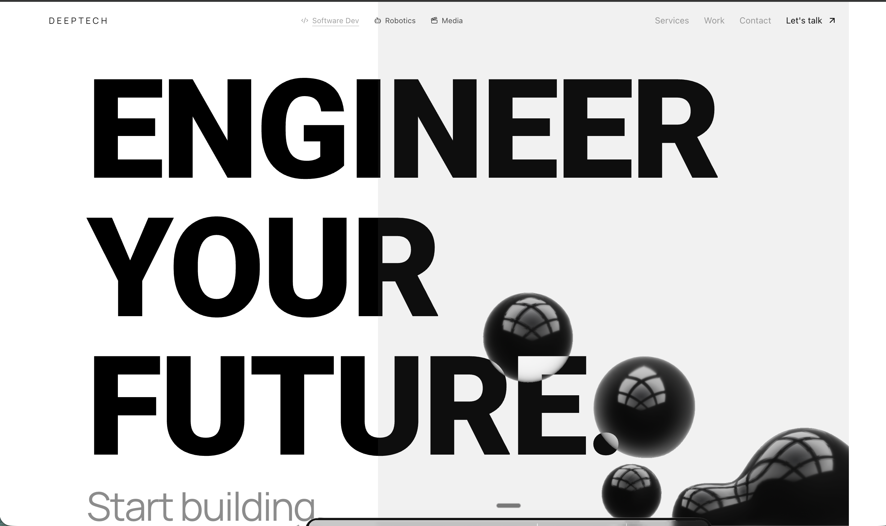

# Deeptech

**Engineering your future. Start building.**

🔗 **Live:** [deeptech.varyai.link](https://deeptech.varyai.link)

Deeptech is a multi-disciplinary technology company building at the intersection of AI and real-world systems. Software development, robotics consulting, and AI-native creative production — one founder, three divisions, everything in-house.

---

## Divisions

### Software Division — `/software`
Production systems enhanced with AI integrations. Legacy retooling, agent platforms, edge infrastructure, and full-stack application development.

### Robotics Division — `/robotics`
Environment-first robotics consulting. Vendor-agnostic sourcing of sidewalk delivery bots, warehouse AMRs, aerial UAVs, and autonomous vehicles. Quote-to-checkout pipeline with Stripe.

### Creative Division — `/creative`
AI-native media studio (A Dark Orchestra Films). Cinematic AI films, generative music videos, and visual art powered by Runway, Kling, Midjourney, Suno, and custom pipelines.

---

## Tech Stack

| Layer | Technology |
|---|---|
| **Framework** | Next.js 15, React 19, TypeScript |
| **Styling** | Tailwind CSS, Manrope / Roboto typefaces |
| **3D / Animation** | Spline, Unicorn Studio |
| **Database** | Upstash Redis (serverless) |
| **Payments** | Stripe Checkout (live mode) + webhook idempotency |
| **Email** | Resend (`info@varyai.link` — DKIM + SPF + DMARC verified) |
| **Hosting** | Vercel (production) |
| **Domain** | `deeptech.varyai.link` |
| **Icons** | Iconify (Lucide, MDI), lucide-react |
| **UI** | Radix UI primitives |

---

## Key Features

- **Quote System** — Admin-generated quotes stored in Redis with line items, vendor costs, and markup. Customers see only their price.
- **Stripe Checkout** — Quote acceptance triggers a live Stripe payment session. Webhook processes `checkout.session.completed` with idempotency.
- **Contact → Nimbus** — Contact form routes sourcing requests to the Clawdbot agent system.
- **Admin Dashboard** — Cookie-authenticated admin panel at `/admin/quotes` for quote management.
- **SEO** — Dynamic `robots.txt`, `sitemap.xml`, OpenGraph images, and Twitter cards.

---

## Pages

| Route | Description |
|---|---|
| `/` | Landing page — hero, services, about, footer |
| `/software` | Software division showcase |
| `/robotics` | Robotics division — environments, systems, services |
| `/creative` | Creative division — A Dark Orchestra Films |
| `/contact` | Contact form |
| `/about` | Creative division vision & capabilities |
| `/gallery` | AI art gallery |
| `/admin/quotes` | Admin quote management (auth-gated) |
| `/quote/[id]` | Customer-facing quote view |
| `/privacy` | Privacy policy |
| `/terms` | Terms of service |

---

## Built By

**Chad Neo** — Founder & CTO

- GitHub: [neoKode1](https://github.com/neoKode1)
- Email: info@varyai.link
- Location: San Francisco, CA

---

© 2026 Deeptech. All rights reserved.
